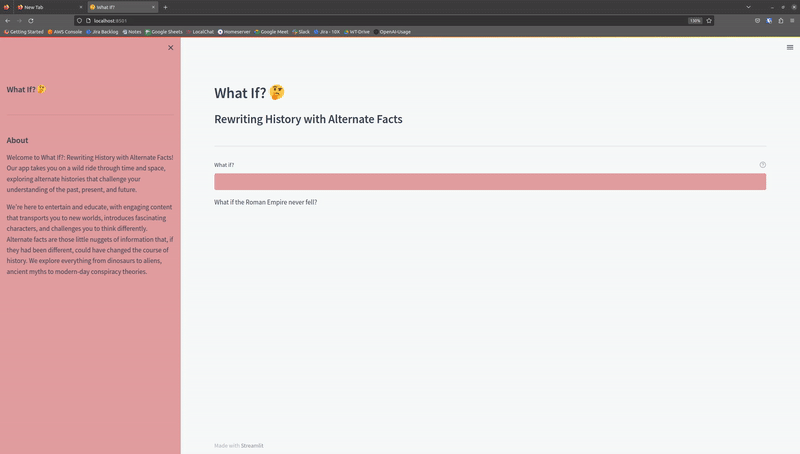

# What If?

Q: Why did I do this?  
A: I was bored and this sounded like a fun thing to do for a couple of hours.


## Introduction
    What if Hitler was accepeted into the Vienna Academy of Fine Arts?  
    What if the United States never gained independence from Great Britain?  
    What if aliens actually visited Earth and helped in constructing the pyramids?  
    What if Napoleon never rose to power in France?
    What if the Soviet Union won the Cold War?
    What if the United States never dropped atomic bombs on Japan?
    What if the Roman Empire never fell?  
Wanna know answer these questions?  
Well sadly, we'll never know. But now with the power of generative AI, we can explore some possibilities based on an 
alternate fact.  

---
  
---

**What If?** is a service that allows users to explore alternate history based on an alternate fact. This service prompts 
users to input a fact or event that could have happened differently, and then generates a new history based on that 
alternate fact. The system generates a detailed timeline of events, incorporating major historical figures, 
technological advancements, and societal changes that would have occurred as a result of the altered fact.  

## Features
- Generate alternate histories based on user input
- Incorporate major historical figures, technological advancements, and societal changes in the alternate history

## Usage
To use What If?, simply input a fact or event that could have happened differently into the prompt, and the system will generate a new history based on that alternate fact.

## Installation
What-If requires docker to run the service.  
What-If uses OpenAI's ChatGPT model (gpt-3.5-turbo) to generate the alternate histories.  
To install What If?, simply clone the repository and run the following command:
```bash
git clone https://github.com/VPanjeta/What-If.git  # Clone the repository
cd What-If  # Change directory to the repository
nano Dockerfile  # Edit the Dockerfile to include your OpenAI API key
# Replace <OPENAI_API_KEY> with your OpenAI API key in the Dockerfile
docker build -t streamlit .  # Build the docker image
docker run -p 8501:8501 streamlit  # Run the docker image
```
Browse to http://localhost:8501 to use "What If?".